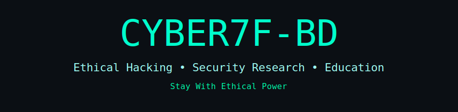

# Wifi-Hack-Rooted-
This tool is a structured WPS PIN generation framework built for educational and ethical Wi-Fi security research. It generates possible WPS PINs using MAC-based algorithms and known static methods for different router brands. The framework is clean, modular, and suitable for learning, testing, and penetration-testing labs only.

<p align="center">
  
</p>


<!-- ================= CYBER7F-BD DARK HACKER FRAMEWORK ================= -->


</p>

<h1 align="center" class="title">Hack Everything</h1>

<p align="center" class="subtitle">
  ⚡ Ethical Hacking • Wi-Fi Security • Research Framework ⚡
</p>

<p align="center" class="badges">
  <span>🛡️ WPS Audit</span> •
  <span>💀 Dark Hacker Theme</span> •
  <span>🐧 Termux Ready</span>
</p>

<hr>

<p align="center" class="desc">
Cyber7F-BD is a professional Wi-Fi security auditing framework built for
educational and ethical research purposes only.  
It focuses on WPS vulnerability testing, smart brute-force logic,
Pixie-Dust based analysis and controlled penetration testing workflows.
</p>

---

## ⚙️ Features
<ul class="list">
  <li>✔ Smart WPS PIN generation</li>
  <li>✔ Pixie Dust attack support</li>
  <li>✔ Session restore & resume</li>
  <li>✔ Dark hacker styled CLI output</li>
  <li>✔ Termux optimized</li>
</ul>

Installation on windows/Linux/mac-os/Termux
git clone https://github.com/R2BRAHUL/Wifi-Hack-Rooted-.git
cd Wifi-Hack-Rooted-
python Cyber7F-BD.py


<h1 align="center" class="title">⚠️ Legal Disclaimer</h1>
This tool is created for educational and authorized security testing only. The developer is not responsible for any misuse or illegal activities. Use it only on networks you own or have explicit permission to test.


<h1 align="center" class="title">Author</h1>
�
Cyber7F-BD Team
Ethical Hacking • Security Research • Education 

“Before running the tool, make sure wpa_supplicant is installed on your system”

---

## 🧰 Requirements (Linux, Ubuntu, Windows,)

```bash
$ apt update && apt upgrade
$ pkg install -y root-repo
$ pkg install -y git tsu python wpa-supplicant pixiewps iw
$ git clone https://github.com/Mahfuz-THBD/Wifi_Hack
$ cd Wifi_Hack
$ chmod +x birihack.py
$ sudo python birihack.py --help
```
<h1 align="center" class="title">Termux Installation:</h1>

```bash
pkg update && pkg upgrade
pkg install python git tsu
git clone https://github.com/R2BRAHUL/Wifi-Hack-Rooted-.git
cd Wifi-Hack-Rooted-
chmod +x Cyber7F-BD.py
python Cyber7F-BD.py
```

<h1 align="center" class="title">Uses:</h1>

#### Example : `sudo python Cyber7F-BD.py -i wlan0 -K`

<h1 align="center" class="title">#### Note:</h1> 
**First turn off your Wifi.**
- Show avaliable networks and start Pixie Dust attack on a specified network.
- `sudo python Cyber7F-BD.py -i wlan0 -K`
- - Start Pixie Dust attack on a specified BSSID:
`sudo python Cyber7F-BD.py -i wlan0 -b 00:91:4C:C3:AC:28 -K`
- Launch online WPS bruteforce with the specified first half of the PIN:
- `sudo python Cyber7F-BD.py -i wlan0 -b 00:90:4C:C1:AC:21 -B -p 1234`
<h1 align="center" class="title">### Troubleshooting</h1>
**"Device or resource busy (-16)" - Turn on Wifi and Then Turn off Wifi.**

